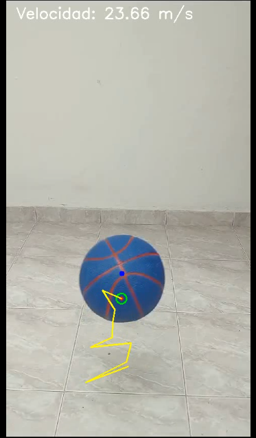

# 🏐 **Tracking Ball - Medición de Velocidad de una Pelota en Movimiento**  

## 📌 **Descripción del Proyecto**  
Este proyecto tiene como objetivo la creación de un modelo para la **detección, seguimiento y medición de velocidad** de una pelota en movimiento dentro de un video. Utilizando **OpenCV, FastAPI y un Filtro de Kalman**, se identifica la posición de la pelota en cada frame, se predice su trayectoria y se calcula su velocidad en metros por segundo (m/s).  

El sistema es **modular y escalable**, permitiendo la ejecución en servidores locales o en la nube mediante **una instancia EC2 en AWS**.  

---

## 📂 **Estructura del Proyecto**
El código está organizado en módulos para facilitar su mantenimiento:

📁 tracking_api/
│── 📁 app/
│   │── main.py                 
│   │── video_tracking.py        
│   │── kalman_filter.py         
│   │── ball_detection.py        
│   │── utils.py                 
│── 📁 videos/                   
│── requirements.txt              

### ***Contenido***

 ***main.py***
 Este código implementa una API utilizando FastAPI para procesar y descargar videos. Se definen dos rutas principales: una para procesar un video local (/process_video/) y otra para descargar el video procesado (/download_video/{filename}). La función process_video, importada del módulo video_tracking, se encarga del procesamiento del video especificado, guardando el resultado en la carpeta videos/. Si el archivo de entrada o salida no existe, la API devuelve un mensaje de error. Además, se utiliza FileResponse para permitir la descarga del video procesado. El módulo os se usa para manejar rutas de archivos y verificar su existencia

 ***video_tracking.py***

 Este código es el núcleo del sistema. Define la función process_video, que se encarga de procesar un video para detectar y rastrear una pelota, calcular su velocidad y guardar el video resultante. el video es cargado con cv.VideoCapture(video_path) y se configura un escritor de video para guardar el resultado (cv.VideoWriter). Luego, se inicializa el Filtro de Kalman con initialize_kalman(), el cual ayuda a suavizar la detección y predecir la posición futura de la pelota. Durante el procesamiento del video, cada frame se convierte a HSV (cv.cvtColor(frame, cv.COLOR_BGR2HSV)) y se aplica la función detect_ball() para detectar la pelota mediante segmentación de color en azul oscuro. Si se encuentra la pelota, su posición se actualiza en el Filtro de Kalman, y se guarda en prev_positions para calcular su trayectoria y velocidad. La predicción de movimiento se dibuja con cv.circle(), y la trayectoria pasada se representa con cv.line(). Para calcular la velocidad, se usa la distancia entre la posición de la pelota en dos frames consecutivos (dist()), dividiendo por el tiempo transcurrido (time_sec), convirtiéndolo a metros por segundo (m/s), y promediando las últimas mediciones para suavizar los resultados (speed_measurements). Finalmente, se superpone el texto con la velocidad en el video (cv.putText()), y cada frame procesado se guarda con out.write(frame), generando un nuevo archivo de video con la pelota resaltada, la trayectoria y la medición de velocidad visible.

 ***ball_detection.py***

 El código define la función detect_ball, que detecta una pelota en una imagen usando técnicas de procesamiento de imágenes de OpenCV. Primero convierte la imagen al espacio de color HSV y crea una máscara combinada (mask) que resalta las regiones dentro de los rangos de colores definidos (lower_colors y upper_colors) utilizando cv.inRange. Luego, aplica operaciones morfológicas de apertura y cierre (cv.morphologyEx) para eliminar el ruido y mejorar la precisión de la detección. Posteriormente, se extraen los contornos (cv.findContours) de las áreas resaltadas, y aquellos con un área mayor a 200 píxeles se consideran válidos. La función identifica el contorno más grande y calcula su círculo envolvente (cv.minEnclosingCircle). Si el radio del círculo está entre 5 y 80 píxeles, se asume que es la pelota y devuelve sus coordenadas y la máscara; de lo contrario, retorna None.

 ***kalman_filter.py***
 Este código define la función initialize_kalman, que configura un Filtro de Kalman utilizando OpenCV para predecir y seguir la trayectoria de un objeto en movimiento, como una pelota. El filtro se inicializa con un estado de 6 dimensiones (posiciones, velocidades y aceleraciones en los ejes X e Y) y una medición de 2 dimensiones (posiciones X e Y). La matriz de medición (measurementMatrix) mapea el estado al espacio de las mediciones, considerando solo las posiciones. La matriz de transición (transitionMatrix) modela cómo evoluciona el estado a lo largo del tiempo, incluyendo posición, velocidad y aceleración. Además, se definen las matrices de covarianza del ruido del proceso (processNoiseCov) y de la medición (measurementNoiseCov), que controlan la incertidumbre del modelo y de las mediciones, respectivamente. Esto permite que el filtro suavice las predicciones y mejore la precisión del seguimiento, especialmente cuando las mediciones son ruidosas o incompletas.

 ***utils.py***

 Para este modulo, se usa simplemente funciones externas, necesarias, tal como la distancia euclidiana implementada en  video_tracker.py, para la implementación de la lógica en la medida de la velocidad

 ## **Instalación y configuración**

 Se iniciara clonando el repo en bash usando git:

 ```bash
 git clone https://github.com/TU_USUARIO/OpenCVBallDetection.git
cd OpenCVBallDetection
 ```

 En donde mediante el archivo requirements.txt se instalan las dependencias necesarias para el proyecto:

 ```bash
 pip install -r requirements.txt
 ```
 
 en caso de tener problemas con la instalación se puede proceder a instalar únicamente la dependencia de forma global para el ambiente virtual que se este implementando
se puede comenzar a ejecutar el API mediante el siguiente comando:

 ```bash
 uvicorn main:app --host 0.0.0.0 --port 8000
 ```
 donde se levantará un host local con el puero 8000
una vez inicializada el api, se procede a un navegador o a un software que reciba solicitudes HTTP tal como postman. Donde se cargará inicialmente con la siguiente URL.

 ```bash
GET http://127.0.0.1:8000:8000/process_video/VideoEjemplo.mp4
 ```
 Por lo que buscara el nombre del video en la carpeta videos/ de la estructura del proyecto y generará un archivo de salida llamado output.mp4 que se podrá descargar mediante la siguiente url

 ```bash
GET http://EC2_PUBLIC_IP:8000/download_video/output.mp4   
 ```

 Esta url la generará automáticamente, el primer enlace, por lo que se podrá acceder a este inmediatamente.


 ## **Instalación de AWS EC2**

Dado que existe un repositorio github, se implemente éste para crear una instancia EC2 de Amazon Web Service, con el fin de crear un servidor de libre uso y poder acceder al modelo de reconocimiento. Para crear dicha instancia se necesito de inscribirse inicialmente a la cuenta. Y hacer uso de la consola AWS, que genera la opción de realizar una creación de una instancia EC2.

En nuestro caso, la instancia EC2 se realizó usando ubunto y con servidor gratis.  Seguidamente se pudo Conectar para acceder al bash y poder realizar los ajustes necesarios como:
Actualización de Paquetes

```bash
sudo apt-get update
```
lo que es necesario para usar los comandos necesarios que me permiten instalar pip de Python y crear un entorno virtual que me permita instalar todo lo necesario que está dentro del archivo requirements:

```bash
sudo apt install -y python3-pip python3-venv ffmpeg
```

Al haber instalado los paquetes necesarios, seguidamente se clona el repositorio y se accede a la carpeta del proyecto

```bash
git clone https://github.com/TU_USUARIO/OpenCVBallDetection.git
cd OpenCVBallDetection
```

Para poder usar el servidor es necesario crear el entorno virtual y activarlo:

```bash
python3 -m venv venv
source venv/bin/activate
```
De esta manera se instalarán dependencias del proyecto dentro del archivo requirements.txt:

```bash
pip install -r requirements.txt
```
una vez instalado los paquetes se accede a la carpeta donde se encuentra el archivo main.py y se levanta el servidor local del servidor EC2, haciendo uso de comando uvicorn:

```bash
uvicorn main:app --host 0.0.0.0 --port 8000
```
lo que permite, ir a la instancia ec2 y acceder a la ip que comparte, para mandar solicitudes get. Con las url ya establecidas

```bash
GET http://EC2_PUBLIC_IP:8000/process_video/{nameVideo}
GET http://EC2_PUBLIC_IP:8000/download_video/output.mp4
```

## **Resultados**

Acá se presentarán algunos de los siguientes resultados obtenidos con el modelo de reconocimiento de la pelota en el video, es decir, la velocidad y la trayectoria de la pelota.

<style>
.image-modificada {
  width: 50%; /* ajusta el ancho según tus necesidades */
  height: auto; /* mantiene la relación de aspecto */
}
</style>




## **Conclusiones**

A pesar, de que puede captar muy bien, el objeto que tiene forma de balón, en algunos casos, se pierde de vista por el ruido y la iluminación, por lo que se puede mejorar el rendimiento del modelo de reconocimiento de la pelota.

también es de destacar que el modelo puede verse mejorado implementado tensorflow, por lo que se puede mejorar la velocidad de reconocimiento de la pelota.

Aún así reconoce el movimiento de la pelota y se puede ver la trayectoria y velocidad de la misma.